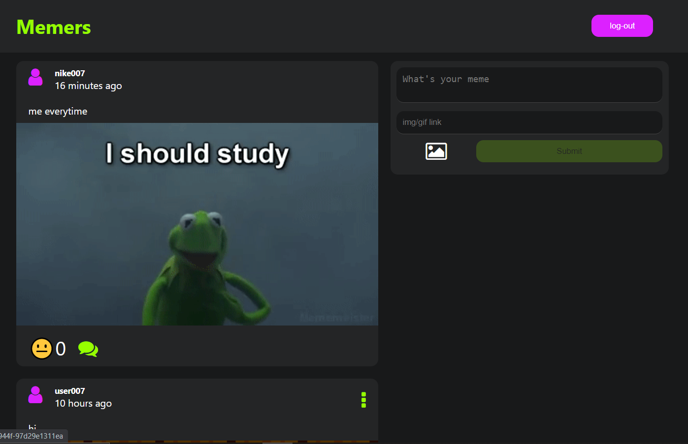
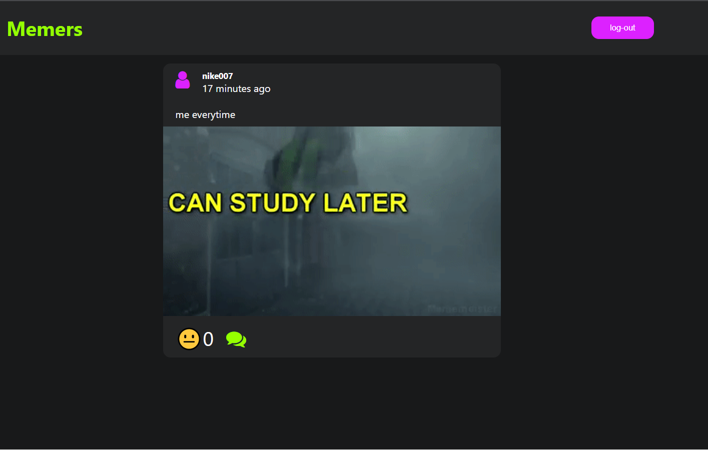
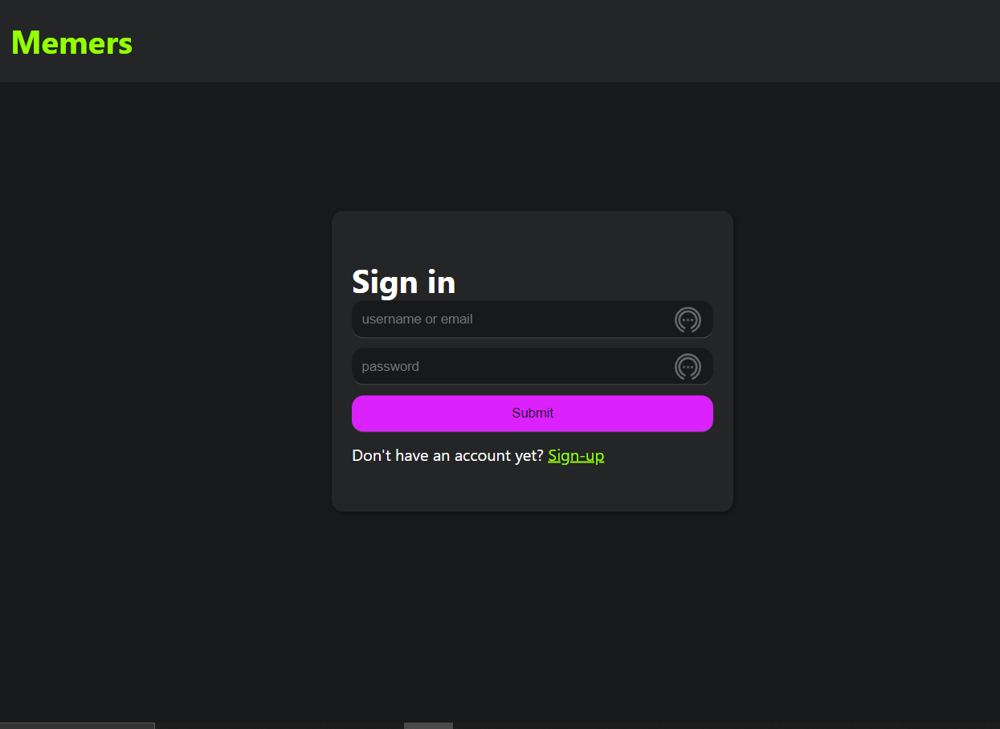
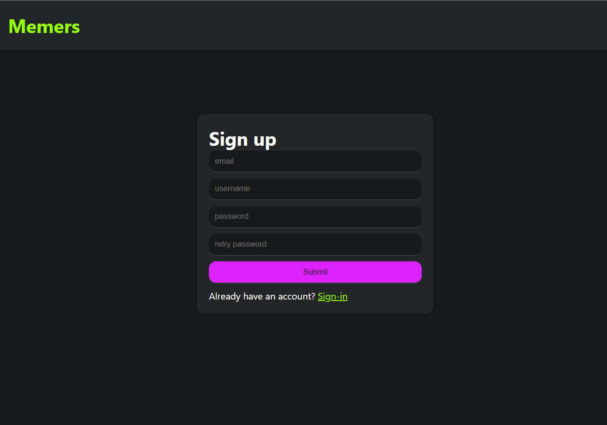

<h1>Memers 😜</h1>
<h3>"This was created during my time as a student at Code Chrysalis."</h3>

  
Table of contents table

  <ol>
    <li><a href="#pictures">Pictures</a></li>
    <li><a href="#aboutApp">About App</a></li>
    <li><a href="#getting-started">Getting Started</a></li>
    <li><a href="#usage">Things you can do</a></li>
    <li><a href="#futureFeatures">Future Features</a></li>
    <li><a href="#contact">Contact</a></li>
  </ol>

<section id="pictures">
  <h1>Images 🖼</h1>
  
  
  
  
  
</section>
<section id="aboutApp">
  <h1>About app 📝</h1>
  
There are lots of memes out there posted in social media. In fact what's a day without a meme. This app is focus on "memers" who loves too post their created memes around the world

  
</section>

<section id="getting-started">
<h1>Getting started</h1>
  <ol>
    <li>
      
Install dependencies - this will run all dependencies needed by the app

      <code>
        npm run ready
      </code>
    </li>
    <li>
      
If the above code does not work you can also do this:

      <ul>
        <li>
          
Install dependencies needed in the server

          <code>
            npm install
          </code>
        </li>
        <li>
          
cd into client directory

          <code>
            cd client
          </code>
        </li>
        <li>
          
Install dependencies needed in the client

          <code>
            npm install
          </code>
        </li>
      </ul>
    </li>
    <li>
      
Run your app

      <code>npm run dev</code>
    </li>
  </ol>
  
</section>

<section id="usage">
  <h1>Things you can do 👍</h1>
  <ul>
    <li>Can create an account</li>
    <li>Can log in to your account</li>
    <li>Can post a meme (must have a media like gif & etc.)</li>
    <li>Can laugh at a meme</li>
    <li>Can comment to a meme</li>
    <li>Can delete a meme (must be yours)</li>
    <li>Can update a meme (must be yours)</li>
  </ul>
  
</section>
<section id="technology">
  <h1>Technology used 💻</h1>

  <ul>
    <li>react</li>
    <li>redux/redux toolkit</li>
    <li>nodejs</li>
    <li>express</li>
    <li>knex</li>
    <li>postgresql</li>
    <li>cloudinary</li>
    <li>heroku</li>
  </ul>
  
</section>
 <section id="futureFeatures">
  <h1>future Features 🔮</h1>
    
Create a feature that will let memers to edit their photo memes to make it more engaging for the users

  
</section>

<section id="contact">
<h1>Contact 📞</h1>

phone number: 09041630614

email: takakiiiyuuu@gmail.com

link: <a href="https://yu-memers.herokuapp.com/" target="_blank">https://yu-memers.herokuapp.com/<a>

  
</section>
  
 
